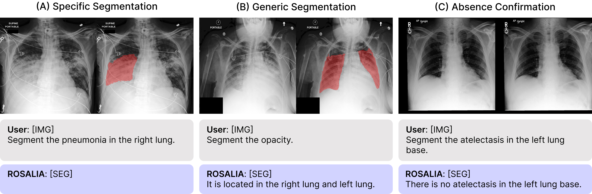

<div align="center">

# Instruction-Guided Lesion Segmentation for Chest X-rays with Automatically Generated Large-Scale Dataset<br>(CVPR 2026 Main)

[](https://arxiv.org/abs/2511.15186)

[Geon Choi*](https://checkoneee.github.io/), Hangyul Yoon*, Hyunju Shin, Hyunki Park, Sang Hoon Seo, [Eunho Yang](https://mli.kaist.ac.kr/), [Edward Choi](https://mp2893.com/index.html)<br>
(*: Equal Contribution)



</div>

---
## 🔥 Summary

Identifying and segmenting lesions in Chest X-rays (CXR) is crucial for accurate medical diagnosis, but conventional approaches face significant challenges:

1. **Scarcity of dense annotations:** Pixel-level labeling by medical experts is extremely expensive and time-consuming.
2. **Lack of flexible interaction:** Existing models often perform fixed sets of tasks and cannot adapt to user-provided instructions or complex clinical prompts.

To address these limitations, we introduce an automated pipeline to generate **MIMIC-ILS**, a large-scale, high-quality segmentation dataset for Chest X-rays without manual human annotation. Utilizing this dataset, we train **ROSALIA**, a Vision-Language Model (VLM) tailored for instruction-guided lesion segmentation.

By interpreting simple, user-friendly instructions instead of relying on complex expert-level prompts, our model can accurately segment diverse thoracic lesions and provide textual explanations, offering a highly accessible and practical approach to medical image analysis.

## 🗓 ️News
- [Feb 2026] 🎉 Our paper has been accepted to **CVPR 2026 Main Track**!
- [Nov 2025] 📜 Preprint is available on [arXiv](https://arxiv.org/abs/2511.15186).

## 🛠️ Setup
First, create your environment. We recommend using the following commands. 

```
git clone https://github.com/checkoneee/ROSALIA.git
cd ROSALIA

conda create -n rosalia python=3.10
conda activate rosalia
pip install -r requirements.txt
```

## ⏳ Models

|Models|Checkpoints|
|:---------|:--------|
|ROSALIA|[Hugging Face]()

## 📝 Citation
If you find our method useful, please cite as below or leave a star to this repository.

```
@article{choi2025instruction,
  title={Instruction-Guided Lesion Segmentation for Chest X-rays with Automatically Generated Large-Scale Dataset},
  author={Choi, Geon and Yoon, Hangyul and Shin, Hyunju and Park, Hyunki and Seo, Sang Hoon and Yang, Eunho and Choi, Edward},
  journal={arXiv preprint arXiv:2511.15186},
  year={2025}
}
```